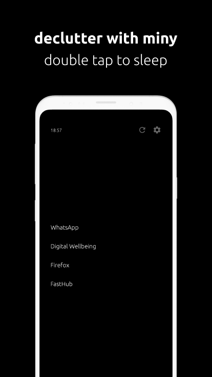
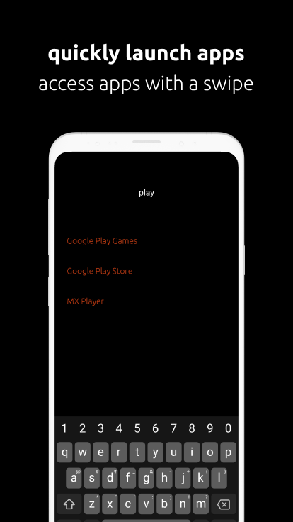

 

<br/>

<h1 align="center">miny</h1>
miny is a decluttered launcher for Android. It is aimed at reducing the craving to constantly check your phone every few minutes. It aims to be a bland but accessible launcher.
<br/>
<br/>
This launcher has been inspired by the "Light Phone" and brings the functionality of your app launcher to a package that is small and fast. It is based on the philosophy of minimalism and aims to declutter your launcher app. miny is completely free to use

<h2 align="center">Download</h2>

[Download from the Play Store](https://play.google.com/store/apps/details?id=com.appallure.miny)

<h2 align="center">Features</h2>

- 4 Shortcuts on the home screen
- Long press to change shortcut
- Swipe towards left to access app drawer
- Start typing the app name to quickly launch the app
- Double tap to switch the screen off
- Small package of size 3mb

<h2 align="center">Screenshots</h2>

 

<h2 align="center">LICENSE</h2>

```
MIT
```
